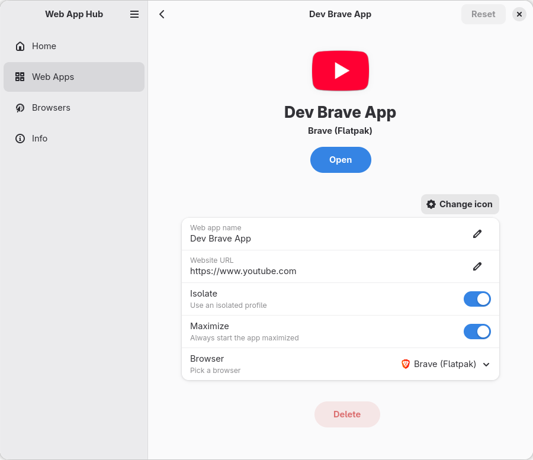

# Web App Hub

A Web App Manager, written in rust with GTK and beautiful Adwaita. With Web App Hub you can manage your Web App with ease. All apps will have their own icon and can be isolated from the normal normal browser profile.

### Features
- Easy browser switching
- Uses your installed browsers
- Isolation build in if the browser supports it
- Apps will have their own icon and dock indicator
- Add custom browser configs with a yaml and a desktop file

[]

## Custom browser config
Browsers are added via config files in `~/.var/app/org.pvermeer.WebAppHub/config/web-app-hub`. The shipped browser configs cannot be editted and will be overwritten everytime the app starts. New configs can be added via these folders. Look in `assests/config` for examples.

### Browser config
`browsers` Folder must have a `.yml` config file:
```yaml
name: Chromium
flatpak: org.chromium.Chromium                              # Optional
system_bin: chromium-browser                                # Optional
can_isolate: true
can_start_maximized: true
desktop_file_name_prefix: org.chromium.Chromium.chromium
base: chromium
issues:                                                     # Optional
  - Does not remember window size and position
```

### Desktop file
`desktop-files` Folder must have a `.desktop` file with the same name
```
[Desktop Entry]
Version=1.0
Type=Application
Terminal=false
Name=%{name}
Exec=%{command} --no-first-run --app="%{url}" --class=chrome-%{domain}__-Default --name=chrome-%{domain}__-Default %{is_isolated ? --user-data-dir} %{is_maximized ? --start-maximized}
X-MultipleArgs=false
Icon=%{icon}
StartupWMClass=chrome-%{domain}__-Default
```

#### Variables
`%{replace_me}` Will be replaced with values from the browser config or app config.

**Supported keys:**
```
%{command}  # Flatpak or binary launch command
%{name}"    # App name
%{url}"     # Complute url
%{domain}   # Domain part of url
%{icon}     # Icon location
%{app_id}   # Generated app id
```

#### Optional variables
`%{optional_key ? if_optional_key_add_me}` Conditional variable

**Supported keys:**
```
%{is_isolated ? --some-var} # Replaced with `--some-var=<profile-path>` if user selected `isolated profile`
%{is_maximized ? --some-var} # Replaced with `--some-var` if user selected `start maximized`
```

### Profile extras (optional)
`profiles` Folder can have an optonal folder with the browser config name that holds files to be copied into the isolated browser profile folder. 

## Building
```sh
cargo build
```
Flatpak
```sh
./flatpak/build.sh
```